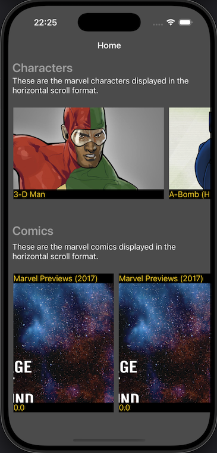
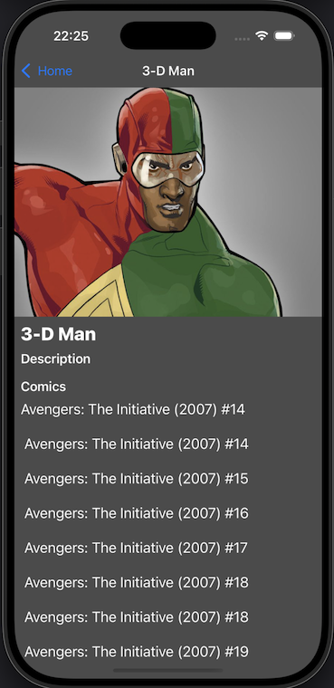

# Marvelite #

A very simple UIKit iOS app that gives us the list of Marvel characters and comics from marvel API. This project uses Swift Package Manager to manage dependencies. It makes use of async/await for handling asynchronous tasks.

# Getting Started

1. You will need Xcode to run the project.
2. Either download the project zip or clone the project to your machine.
3. Open the CleanMarvelite.xcodeproj file.
4. Run the active scheme (CleanMarvelite).

# Architecture

The project has been divided into 3 main layers/modules. Data layer, Domain layer and Presentation layer where Domain layer is the inner most layer and not dependent on any other layers. The presentation layer and Data layer depends on the Domain layer. It is safe to say that there is also another layer namely app layer that knows about all the above 3 layers where I have put the dependency injection code. The modules interact through well-defined boundaries, ensuring each layer depends only on abstractions and not on concrete implementations. A couple of screenshots for the app is shown below.

# External Frameworks

The project uses Swift Package Manager to manages 3rd party libraries. This is the list of frameworks used.
1. [SDWebImage](https://github.com/SDWebImage/SDWebImage) -> This framework helps in loading and caching images with asynchronous image downloading and display.

# API

The project uses https://developer.marvel.com/documentation/getting_started REST api to fetch the Marvel comics and characters.
